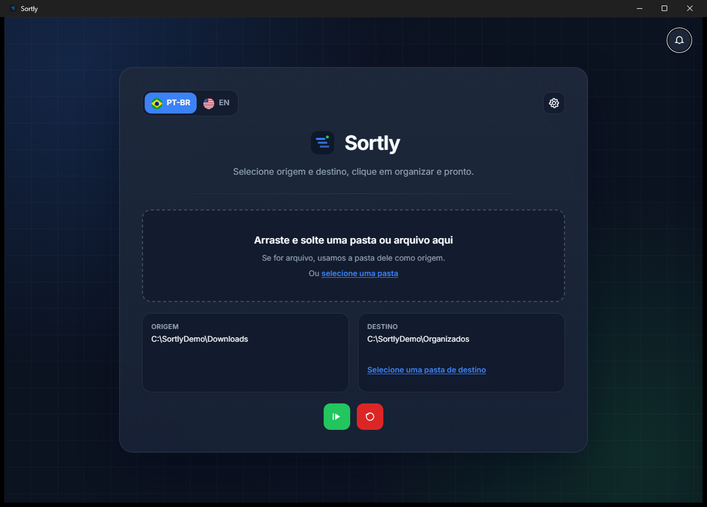

<p align="center">
  
</p>

<h1 align="center">Sortly</h1>

<p align="center">
  Organize seus arquivos em segundos — simples, rápido e seguro.<br/>
  <em>Organize your files in seconds — simple, fast and safe.</em>
</p>

<p align="center">
  <a href="#português">Português</a> · <a href="#english">English</a>
</p>

---

## Português

### O que é o Sortly

O Sortly é um aplicativo de desktop que organiza os arquivos de uma pasta em subpastas, de acordo com os critérios que você escolher. Você seleciona a pasta, marca como quer agrupar e o Sortly faz o resto. Se não gostar do resultado, desfaz com um clique.

A ideia é resolver aquela pasta de Downloads ou de Documentos que virou bagunça, sem precisar mover arquivo por arquivo e sem risco de perder nada.

### Interface

<p align="center">
  
</p>

<p align="center">
  
</p>

> As imagens serão adicionadas em `docs/images/` ao final da migração.

### Funcionalidades

- **Organiza por critérios combináveis:** extensão, data de modificação, tamanho, resolução (imagens), duração (vídeos mp4) e número de páginas (pdf, docx, odt).
- **Origem e destino:** organize dentro da própria pasta ou envie tudo para outra.
- **Arrastar e soltar:** solte uma pasta (ou um arquivo dela) na janela para começar.
- **Nada é sobrescrito:** arquivos com o mesmo nome viram `nome (1).ext`, `nome (2).ext`…
- **Desfazer:** reverte a última organização, mesmo depois de fechar e abrir o app.
- **Notificações:** histórico do que foi feito em cada ação.
- **Português e inglês.**

Quando um arquivo não tem a informação necessária (por exemplo, um vídeo sem duração legível), ele vai para uma pasta `unknown`. Apenas os arquivos da pasta escolhida são organizados; subpastas existentes não são alteradas.

As regras completas estão em [docs/organization-rules.md](docs/organization-rules.md).

### Por que uma nova versão?

A versão 1.0 foi feita com Electron, que embute um navegador inteiro em cada app. O Sortly está sendo reescrito com [Wails](https://wails.io) (Go + React), que usa o navegador já presente no sistema. O objetivo é **consumir bem menos memória** e gerar um instalador menor, mantendo a mesma interface. Detalhes em [docs/adr/0001-electron-para-wails.md](docs/adr/0001-electron-para-wails.md).

### Instalação

Baixe o instalador na aba [Releases](https://github.com/caiofdev/sortly/releases) e siga as instruções.

| Sistema | Formato |
|---|---|
| Windows | instalador `.exe` |
| macOS | `.dmg` *(a partir da versão 2.0)* |
| Linux | `.deb` / AppImage *(a partir da versão 2.0)* |

### Desenvolvimento

> 🚧 A migração para Wails está em andamento na branch `wails-rewrite` ([milestone](https://github.com/caiofdev/sortly/milestone/1)). Até ela terminar, o app roda com Electron.

**Versão atual (Electron)** — requer Node.js 20+:

```bash
npm install
npm run dev      # modo desenvolvimento
npm run build    # gera o instalador em release/
```

**Versão Wails** — requer Go 1.23+, Node.js 20+ e a [Wails CLI v2](https://wails.io/docs/gettingstarted/installation):

```bash
wails doctor     # verifica o ambiente
wails dev        # modo desenvolvimento
wails build      # gera o executável
```

### Testes

Os testes seguem dois conceitos:

- **Complexidade ciclomática:** cada função com complexidade N tem pelo menos N casos de teste, e nenhuma função passa de 10.
- **Análise de valor-limite:** cada fronteira (tamanho, data, duração, conflito de nomes…) é testada no limite, logo antes e logo depois dele.

```bash
go test ./...    # backend
npm test         # frontend
```

### Documentação

A documentação técnica fica em [docs/](docs/README.md): arquitetura, regras de organização, decisões (ADRs) e code review.

### Contribuindo

Commits seguem o padrão semântico com o número da issue:

```
feat(sortly-12): adiciona drag and drop nativo
```

O que muda para o usuário é registrado no [CHANGELOG](CHANGELOG.md).

### Autores

- **Caio Fernandes dos Reis** — [@caiofdev](https://github.com/caiofdev)
- **Claude** (Anthropic) — coautor

### Licença

MIT.

---

## English

### What is Sortly

Sortly is a desktop app that organizes the files in a folder into subfolders, based on the criteria you choose. You pick the folder, select how to group the files, and Sortly does the rest. If you don't like the result, undo it with one click.

It is meant for that Downloads or Documents folder that became a mess — no moving files one by one, and no risk of losing anything.

### Interface

<p align="center">
  
</p>

<p align="center">
  
</p>

> Images will be added to `docs/images/` when the migration is complete.

### Features

- **Combinable criteria:** extension, modification date, size, resolution (images), duration (mp4 videos) and page count (pdf, docx, odt).
- **Source and destination:** organize in place or move everything to another folder.
- **Drag and drop:** drop a folder (or a file inside it) on the window to start.
- **Nothing is overwritten:** files with the same name become `name (1).ext`, `name (2).ext`…
- **Undo:** reverts the last organization, even after closing and reopening the app.
- **Notifications:** a history of what each action did.
- **Portuguese and English.**

When a file lacks the required information (for example, a video without a readable duration), it goes into an `unknown` folder. Only files in the selected folder are organized; existing subfolders are left untouched.

### Why a new version?

Version 1.0 was built with Electron, which bundles a full browser in every app. Sortly is being rewritten with [Wails](https://wails.io) (Go + React), which uses the browser already present in the operating system. The goal is **much lower memory usage** and a smaller installer, with the same interface.

### Installation

Download the installer from [Releases](https://github.com/caiofdev/sortly/releases).

| System | Format |
|---|---|
| Windows | `.exe` installer |
| macOS | `.dmg` *(from version 2.0)* |
| Linux | `.deb` / AppImage *(from version 2.0)* |

### Development

> 🚧 The Wails migration is in progress on the `wails-rewrite` branch ([milestone](https://github.com/caiofdev/sortly/milestone/1)). Until it is done, the app runs on Electron.

**Current version (Electron)** — requires Node.js 20+:

```bash
npm install
npm run dev
npm run build
```

**Wails version** — requires Go 1.23+, Node.js 20+ and the [Wails CLI v2](https://wails.io/docs/gettingstarted/installation):

```bash
wails doctor
wails dev
wails build
```

### Tests

Tests follow cyclomatic complexity (at least N test cases for a function with complexity N, and no function above 10) and boundary value analysis.

```bash
go test ./...
npm test
```

### Documentation

Technical documentation (in Portuguese) lives in [docs/](docs/README.md).

### Authors

- **Caio Fernandes dos Reis** — [@caiofdev](https://github.com/caiofdev)
- **Claude** (Anthropic) — co-author

### License

MIT.
