<p align="center">
  
</p>

<h1 align="center">Sortly</h1>

<p align="center">
  Organize seus arquivos em segundos — simples, rápido e seguro.<br/>
  <em>Organize your files in seconds — simple, fast and safe.</em>
</p>

<p align="center">
  <a href="#português">Português</a> · <a href="#english">English</a>
</p>

---

## Português

### O que é o Sortly

O Sortly é um aplicativo de desktop que organiza os arquivos de uma pasta em subpastas, de acordo com os critérios que você escolher. Você seleciona a pasta, marca como quer agrupar e o Sortly faz o resto. Se não gostar do resultado, desfaz com um clique.

A ideia é resolver aquela pasta de Downloads ou de Documentos que virou bagunça, sem precisar mover arquivo por arquivo e sem risco de perder nada.

### Interface

<p align="center">
  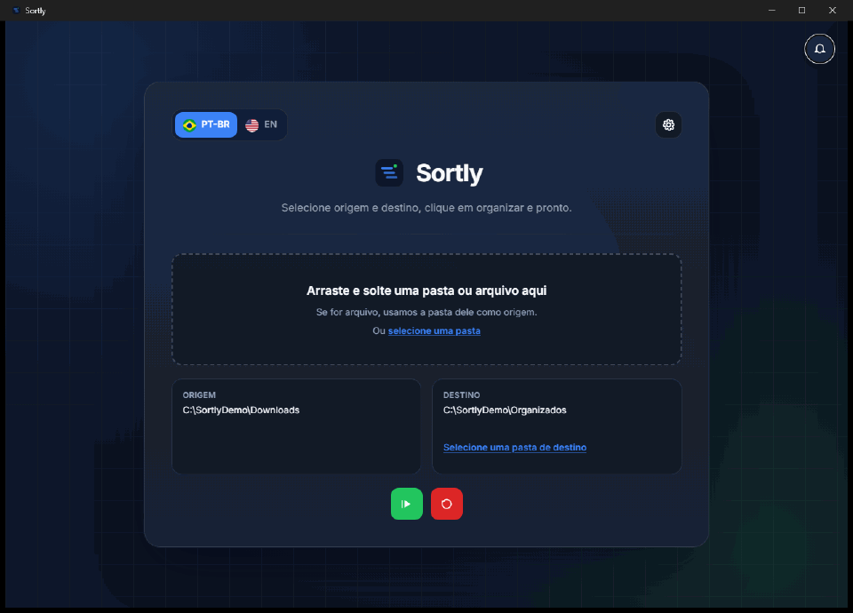
</p>

| Prévia da origem | Organizando |
|---|---|
| 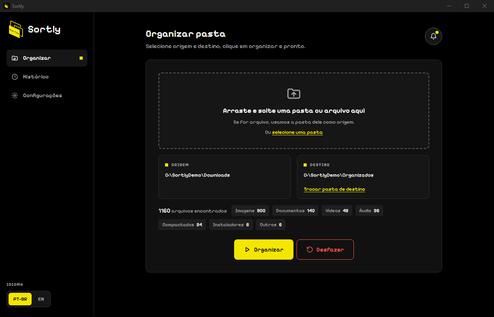 | 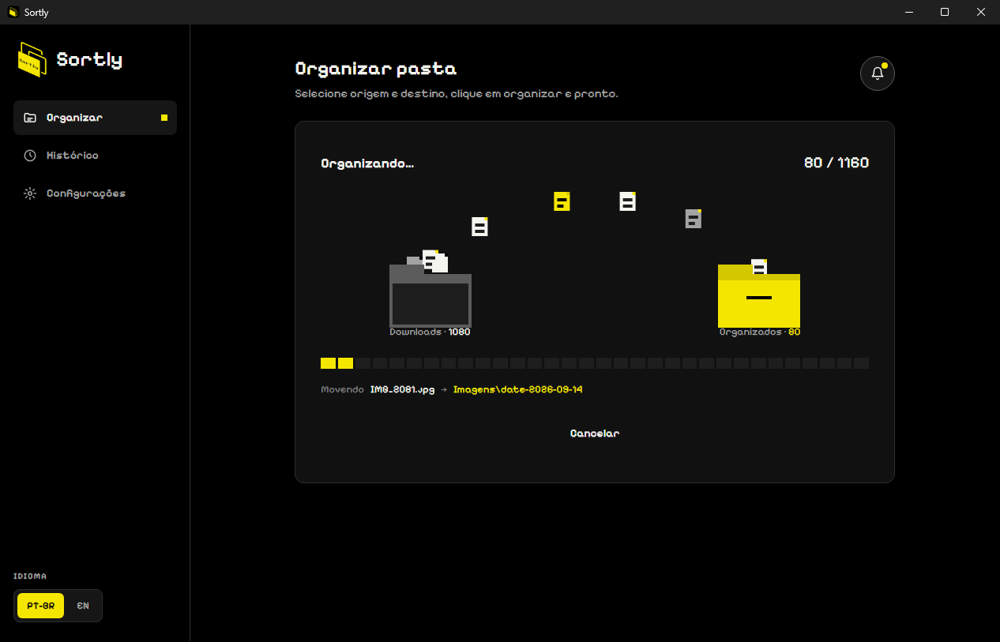 |

| Concluído | Histórico |
|---|---|
| 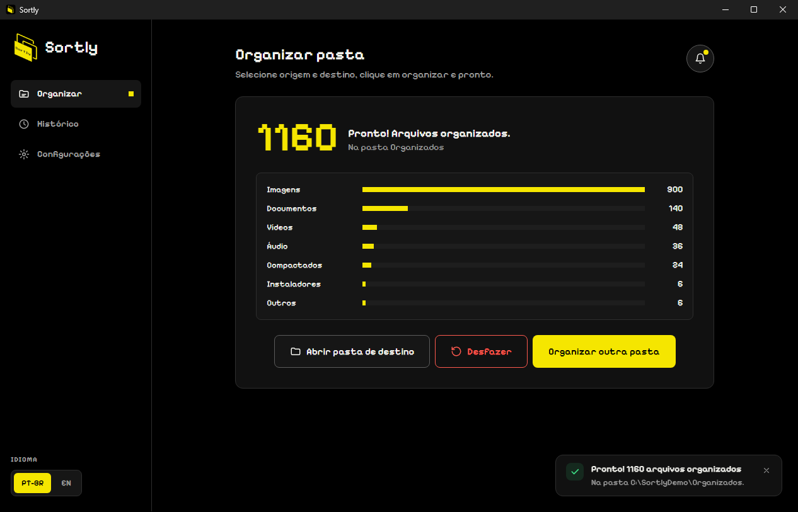 | 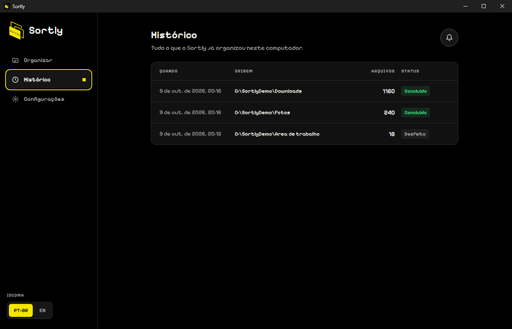 |

| Configurações | Notificações |
|---|---|
| 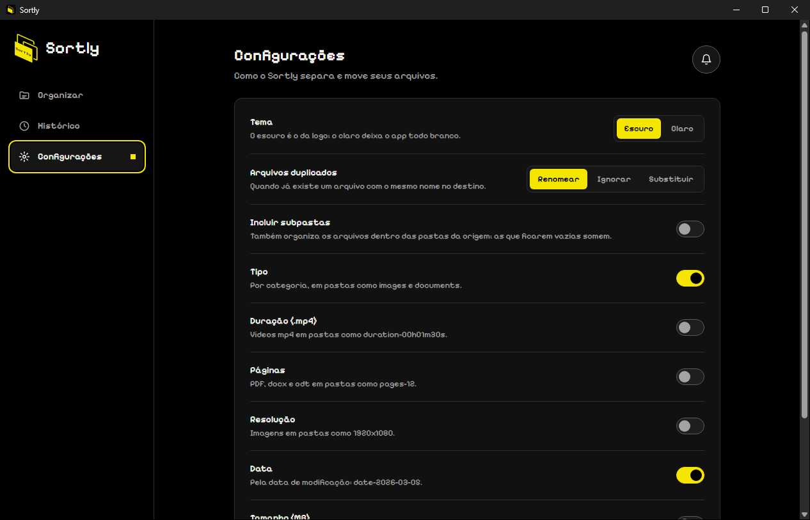 | 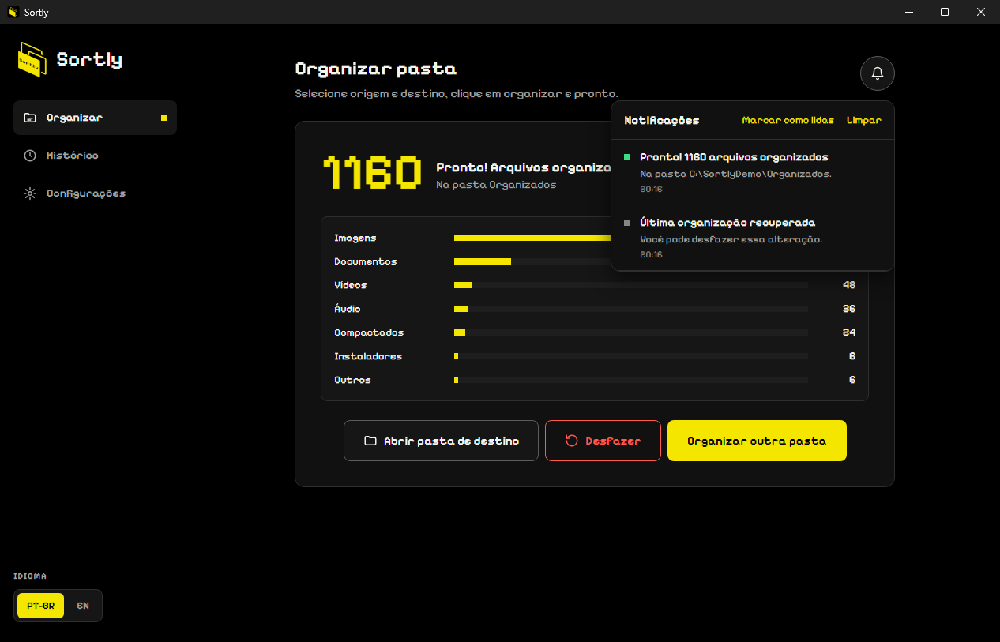 |

### Funcionalidades

- **Organiza por critérios combináveis:** tipo (imagens, documentos, vídeos…), extensão, data de modificação, tamanho, resolução (imagens), duração (vídeos mp4) e número de páginas (pdf, docx, odt).
- **Prévia:** ao escolher a pasta, o Sortly mostra quantos arquivos encontrou e para quais pastas eles vão, antes de mover qualquer coisa.
- **Progresso e Cancelar:** acompanhe cada arquivo indo para a pasta dele e interrompa quando quiser; o que já foi movido pode ser desfeito.
- **Resumo e histórico:** ao terminar, quantos arquivos foram para cada pasta; a página Histórico guarda as últimas 50 organizações.
- **Origem e destino:** organize dentro da própria pasta ou envie tudo para outra.
- **Arrastar e soltar:** solte uma pasta (ou um arquivo dela) na janela para começar.
- **Arquivos duplicados:** renomear (`nome (1).ext`, o padrão), ignorar ou substituir. O substituído fica guardado e volta se você desfizer.
- **Subpastas (opcional):** organiza também os arquivos de dentro das pastas da origem.
- **Desfazer:** reverte a última organização, mesmo depois de fechar e abrir o app.
- **Notificações:** avisos no canto da tela e um painel com tudo o que foi feito.
- **Tema escuro e claro, português e inglês.**

Quando um arquivo não tem a informação necessária (por exemplo, um vídeo sem duração legível), ele vai para uma pasta `unknown`. Por padrão, só os arquivos do primeiro nível da pasta escolhida são organizados, e as subpastas ficam como estão.

As regras completas estão em [docs/organization-rules.md](docs/organization-rules.md).

### Por que uma nova versão?

A versão 1.0 foi feita com Electron, que embute um navegador inteiro em cada app. A versão 2.0 foi reescrita com [Wails](https://wails.io) (Go + React), que usa o navegador já presente no sistema. O resultado é um app com as mesmas regras, **instalador 9× menor** (8,8 MB em vez de 82 MB), **15× menos espaço em disco**, **cerca de 1/3 menos memória** no Windows (177 MB em vez de 260 MB em repouso; metade no pico ao organizar) e organização cerca de 2× mais rápida. Depois, a interface ganhou um visual novo, a partir da logo nova ([ADR 0006](docs/adr/0006-design-system-no-lugar-do-tailwind.md)), e os recursos acima. Os números estão em [docs/benchmark.md](docs/benchmark.md). Decisão em [docs/adr/0001-electron-para-wails.md](docs/adr/0001-electron-para-wails.md).

### Instalação

Baixe o instalador na aba [Releases](https://github.com/caiofdev/sortly/releases) e siga as instruções.

| Sistema | Formato |
|---|---|
| Windows 10/11 | instalador `.exe` (atualiza a versão 1.0 e mantém o desfazer pendente) |
| macOS 10.13+ | `.dmg` (Intel e Apple Silicon) |
| Linux (Debian/Ubuntu) | `.deb` |

Detalhes de cada pacote em [docs/release.md](docs/release.md).

### Desenvolvimento

Requer Go 1.25+, Node.js 20+ e a [Wails CLI v2](https://wails.io/docs/gettingstarted/installation). No Linux, também `libgtk-3-dev` e `libwebkit2gtk-4.1-dev`.

```bash
wails doctor     # verifica o ambiente
wails dev        # modo desenvolvimento, com recarga do frontend
wails build      # gera build/bin/Sortly(.exe)
```

O backend em Go fica em `backend/` e a interface React em `frontend/`. Estrutura, comandos e convenções: [docs/development.md](docs/development.md).

### Testes

Os testes seguem dois conceitos:

- **Complexidade ciclomática:** cada função com complexidade N tem pelo menos N casos de teste, e nenhuma função passa de 10.
- **Análise de valor-limite:** cada fronteira (tamanho, data, duração, conflito de nomes…) é testada no limite, logo antes e logo depois dele.

```bash
go test ./...    # backend
cd frontend && npm test   # frontend
```

Detalhes, critérios e o que a CI executa: [docs/development.md](docs/development.md#4-testes-e-qualidade).

### Documentação

A documentação técnica fica em [docs/](docs/):

- [architecture.md](docs/architecture.md): arquitetura e contrato entre backend e frontend;
- [organization-rules.md](docs/organization-rules.md): regras de organização e desfazer;
- [development.md](docs/development.md): ambiente, testes e fluxo de contribuição;
- [release.md](docs/release.md): versões e pacotes;
- [benchmark.md](docs/benchmark.md): memória, velocidade e tamanho comparados à 1.0;
- [adr/](docs/adr/): decisões de arquitetura.

### Contribuindo

Commits seguem o padrão semântico com o número da issue:

```
feat(sortly-12): adiciona drag and drop nativo
```

Cada issue tem sua própria branch (`sortly-N-descricao`), que sai de `main` e volta para ela por pull request. Os PRs abrem já preenchidos com o [template](.github/pull_request_template.md): issue, resumo, testes (complexidade ciclomática e valor-limite), checklist e autores. O fluxo completo está em [docs/development.md](docs/development.md#6-fluxo-de-contribuição).

O que muda para o usuário é registrado no [CHANGELOG](CHANGELOG.md).

### Autores

- **Caio Fernandes dos Reis** — [@caiofdev](https://github.com/caiofdev)
- **Claude** (Anthropic) — coautor

### Licença

MIT.

---

## English

### What is Sortly

Sortly is a desktop app that organizes the files in a folder into subfolders, based on the criteria you choose. You pick the folder, select how to group the files, and Sortly does the rest. If you don't like the result, undo it with one click.

It is meant for that Downloads or Documents folder that became a mess — no moving files one by one, and no risk of losing anything.

### Interface

| Source preview | Organizing |
|---|---|
| 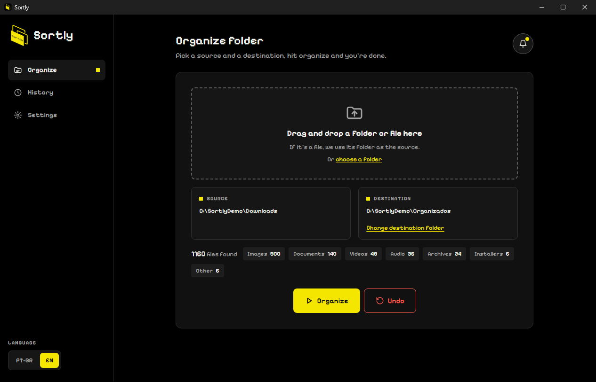 | 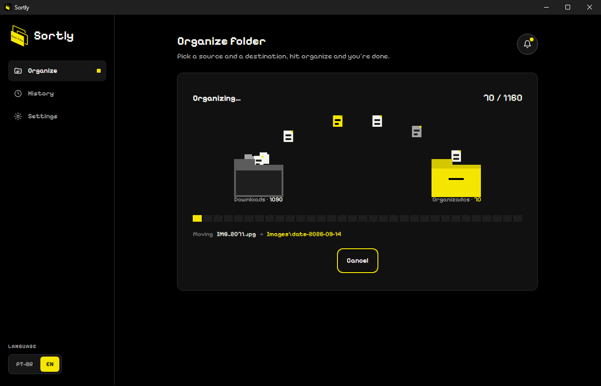 |

| Done | History |
|---|---|
| 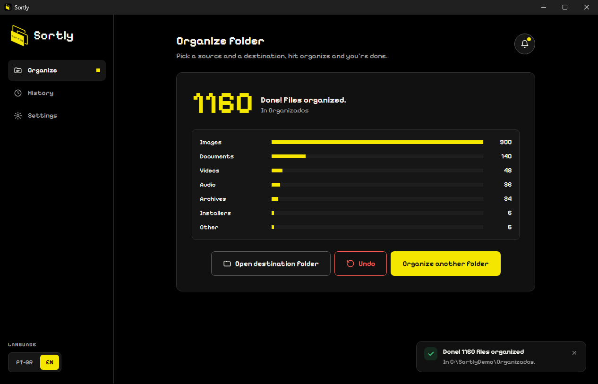 | 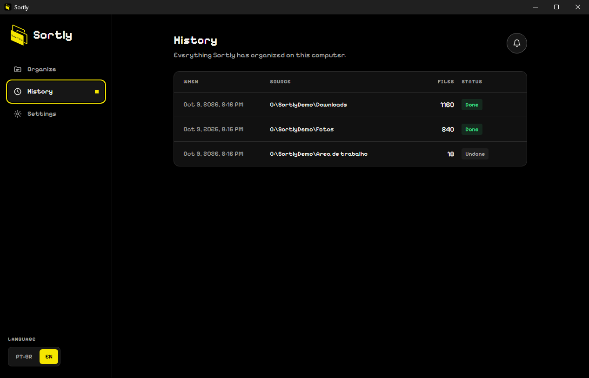 |

| Settings | Light theme |
|---|---|
| 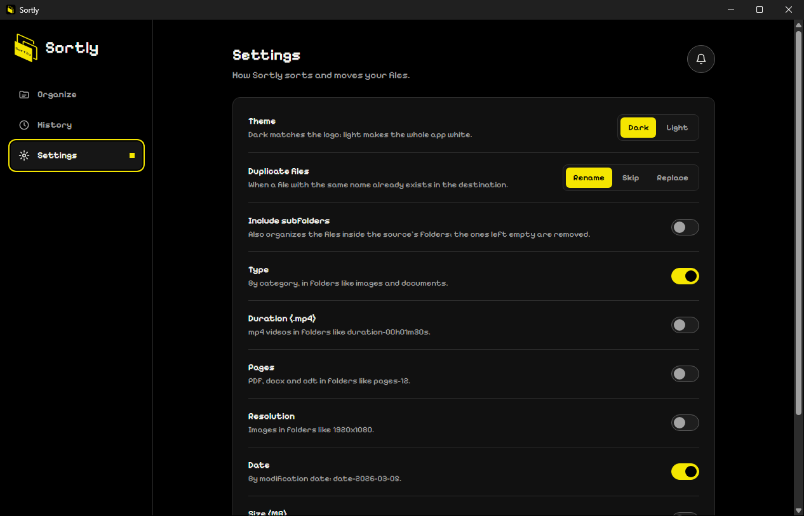 | 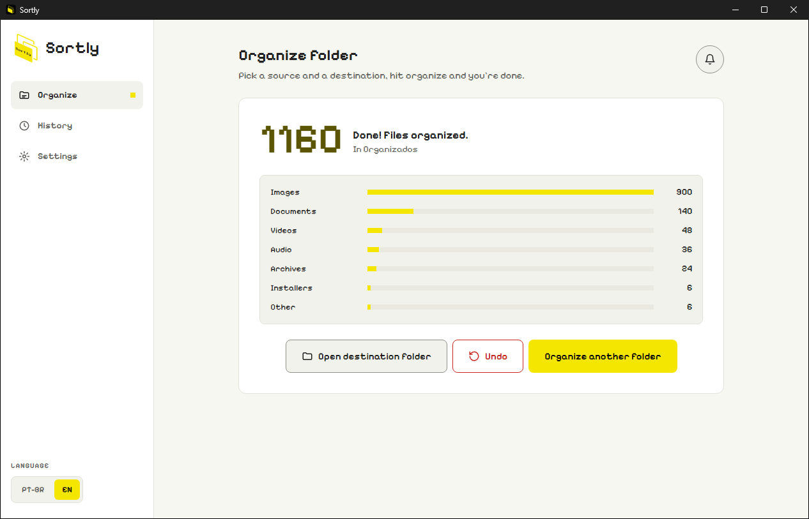 |

### Features

- **Combinable criteria:** type (images, documents, videos…), extension, modification date, size, resolution (images), duration (mp4 videos) and page count (pdf, docx, odt).
- **Preview:** when you pick the folder, Sortly shows how many files it found and where they will go, before moving anything.
- **Progress and Cancel:** watch each file go to its folder and stop whenever you want; whatever was already moved can be undone.
- **Summary and history:** when it finishes, how many files went to each folder; the History page keeps the last 50 organizations.
- **Source and destination:** organize in place or move everything to another folder.
- **Drag and drop:** drop a folder (or a file inside it) on the window to start.
- **Duplicate files:** rename (`name (1).ext`, the default), skip or replace. The replaced file is kept and comes back if you undo.
- **Subfolders (optional):** also organizes the files inside the source's folders.
- **Undo:** reverts the last organization, even after closing and reopening the app.
- **Notifications:** toasts in the corner and a panel with everything that was done.
- **Dark and light themes, Portuguese and English.**

When a file lacks the required information (for example, a video without a readable duration), it goes into an `unknown` folder. By default, only the files at the top level of the selected folder are organized, and subfolders are left as they are.

### Why a new version?

Version 1.0 was built with Electron, which bundles a full browser in every app. Version 2.0 was rewritten with [Wails](https://wails.io) (Go + React), which uses the browser already present in the operating system. The result is the same rules with a **9× smaller installer** (8.8 MB instead of 82 MB), **15× less disk space**, **about 1/3 less memory** on Windows (177 MB instead of 260 MB at idle; half at peak while organizing) and roughly 2× faster organizing. The interface then got a new look, based on the new logo, and the features above. See [docs/benchmark.md](docs/benchmark.md).

### Installation

Download the installer from [Releases](https://github.com/caiofdev/sortly/releases).

| System | Format |
|---|---|
| Windows 10/11 | `.exe` installer (upgrades version 1.0 and keeps a pending undo) |
| macOS 10.13+ | `.dmg` (Intel and Apple Silicon) |
| Linux (Debian/Ubuntu) | `.deb` |

### Development

Requires Go 1.25+, Node.js 20+ and the [Wails CLI v2](https://wails.io/docs/gettingstarted/installation). On Linux, also `libgtk-3-dev` and `libwebkit2gtk-4.1-dev`.

```bash
wails doctor
wails dev
wails build
```

The Go backend lives in `backend/` and the React UI in `frontend/`. See [docs/development.md](docs/development.md) (in Portuguese).

### Tests

Tests follow cyclomatic complexity (at least N test cases for a function with complexity N, and no function above 10) and boundary value analysis.

```bash
go test ./...
cd frontend && npm test
```

### Documentation

Technical documentation (in Portuguese) lives in [docs/](docs/): architecture, organization rules, development and testing, release, benchmark and ADRs.

### Contributing

Commits follow the semantic format with the issue number, e.g. `feat(sortly-12): add native drag and drop`. Each issue gets its own branch (`sortly-N-description`) and a pull request, which opens pre-filled with the [PR template](.github/pull_request_template.md).

### Authors

- **Caio Fernandes dos Reis** — [@caiofdev](https://github.com/caiofdev)
- **Claude** (Anthropic) — co-author

### License

MIT.
