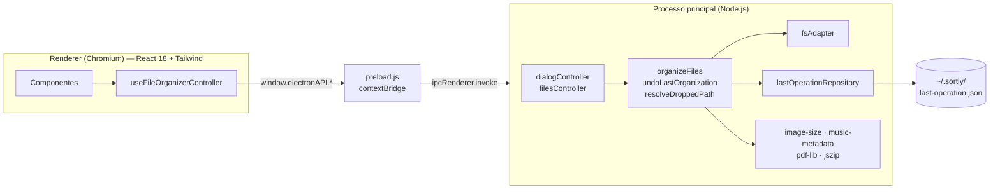
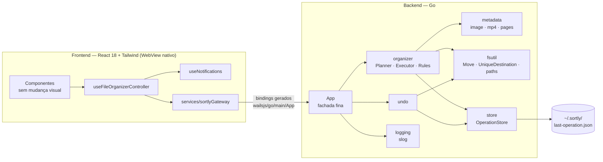

# Arquitetura

> Autores: Caio Reis, Claude

O Sortly está migrando de **Electron** para **Wails v2** (backend em Go + frontend React). Este documento descreve as duas arquiteturas: a atual, que serve de referência de comportamento, e a alvo, que guia a implementação. A motivação está na [ADR 0001](adr/0001-electron-para-wails.md).

## 1. Arquitetura atual (Electron 1.0)



### Contrato IPC atual

São 6 chamadas do tipo requisição/resposta e nenhum evento do backend para a interface.

| Método (`window.electronAPI`) | Entrada | Saída |
|---|---|---|
| `selectSourceFolder()` | — | caminho ou `null` |
| `selectDestinationFolder()` | — | caminho ou `null` |
| `resolveDroppedPath(path)` | caminho | `{ sourceFolderPath }` |
| `getLastOrganizationState()` | — | `{ hasUndo, sourceFolderPath, destinationFolderPath }` |
| `organizeFiles(payload)` | `{ sourceFolderPath, destinationFolderPath, organizationOptions }` | `{ processedFiles, movedFiles, ignoredWithoutExtension, ignoredFolders, canUndo, … }` |
| `undoLastOrganization()` | — | `{ restoredFiles, renamedOnRestore, skippedMissing, canUndo }` |

As regras de negócio estão em [organization-rules.md](organization-rules.md).

## 2. Arquitetura alvo (Wails v2)

O Wails usa o WebView nativo do sistema (WebView2 no Windows, WKWebView no macOS, WebKitGTK no Linux), em vez de embutir um Chromium e um Node completos. O backend vira um único binário Go.



### 2.1 Pacotes Go

| Pacote | Responsabilidade |
|---|---|
| `main` (`main.go`, `app.go`) | Inicializa o Wails, monta as dependências e expõe os métodos para o frontend. `App` só delega (fachada) |
| `internal/organizer` | Validação das opções, `SegmentRule` + registry ([ADR 0003](adr/0003-strategy-regras.md)), `Planner` (calcula o plano, sem efeitos colaterais), `Executor` (aplica os movimentos e mantém o journal), erros com código ([ADR 0004](adr/0004-erros-com-codigo.md)) |
| `internal/metadata` | Leitura de resolução de imagens, duração de mp4 e contagem de páginas (`PageCounter` por extensão) |
| `internal/undo` | Reverte o journal da última operação e remove as pastas que ficaram vazias |
| `internal/store` | `OperationStore`: lê e grava o registro da última operação de forma atômica, no mesmo formato JSON da versão Electron |
| `internal/fsutil` | `Move` (rename com fallback entre volumes), `UniqueDestination`, comparação de caminhos |
| `internal/logging` | Configuração do `log/slog` em arquivo |

Princípios:

- **Injeção de dependências por construtor.** Interfaces pequenas, declaradas no pacote que as consome, permitem usar fakes nos testes.
- **Planejar separado de executar.** O `Planner` não toca no disco, o que o torna fácil de testar e prepara um futuro modo de pré-visualização.
- **`context.Context`** em operações longas, já preparado para cancelamento e progresso.
- **Complexidade ciclomática ≤ 10 por função**, verificada no CI.

### 2.2 Frontend

A interface **não muda visualmente**. A lógica é reorganizada ([ADR 0002](adr/0002-gateway-frontend.md)):

| Módulo | Responsabilidade |
|---|---|
| `services/sortlyGateway.js` | Único ponto de acesso ao backend. Encapsula os bindings Wails e traduz códigos de erro |
| `controllers/useFileOrganizerController.js` | Estado da tela e ações (`selectFolder`, `runAction`) |
| `hooks/useNotifications.js` | Histórico de notificações (limite de 80) |
| `hooks/usePersistentState.js` | Estado salvo no `localStorage` (idioma e critérios) |
| `domain/organizationOptions.js` | Lista de critérios, valores padrão e a regra de "pelo menos um critério" |
| `views/`, `components/` | Apenas apresentação |

### 2.3 Estrutura de diretórios

```
sortly/
  main.go, app.go, wails.json, go.mod
  internal/{organizer,metadata,undo,store,fsutil,logging}/
  frontend/            # Vite + React + Tailwind
    src/{components,views,controllers,hooks,services,domain,utils,i18n}/
  build/               # ícones e configuração do instalador
  docs/                # esta documentação
  .github/workflows/   # CI
```

## 3. Compatibilidade entre versões

- Os nomes das pastas criadas são idênticos.
- O formato de `~/.sortly/last-operation.json` é o mesmo, então um desfazer pendente da versão Electron funciona na Wails.
- Os textos em português exibidos ao usuário continuam os mesmos.
- As preferências no `localStorage` **não** são migradas, porque a origem do WebView muda. O usuário volta aos padrões (português, critério Extensão) uma única vez.
