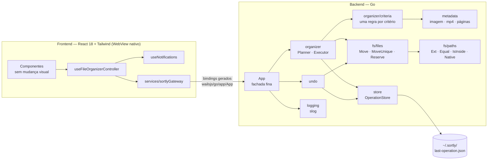

# Arquitetura

> Autores: Caio Reis, Claude

O Sortly usa **Wails v2**: backend em Go e frontend React num WebView nativo. Por que não Electron: [ADR 0001](adr/0001-electron-para-wails.md). As regras de negócio estão em [organization-rules.md](organization-rules.md).

## 1. Visão geral

O Wails usa o WebView nativo do sistema (WebView2 no Windows, WKWebView no macOS, WebKitGTK no Linux), em vez de embutir um Chromium e um Node completos. O backend vira um único binário Go.

## 2. Pacotes Go

| Pacote | Responsabilidade |
|---|---|
| `main` (`main.go`) | Embute `frontend/dist`, monta as dependências e chama `wails.Run`. Fica na raiz porque o `go:embed` não aceita `..` e a CLI do Wails v2 compila o pacote da pasta do `wails.json` |
| `backend/app` | Fachada `App` exposta ao frontend (só delega aos serviços), drop nativo, opções da janela (`Options`) e composição das dependências (`wire.go`) |
| `backend/organizer` | Validação do pedido, `Planner` (calcula o plano, sem efeitos colaterais), `Executor` (aplica os movimentos e mantém o journal), erros com código ([ADR 0004](adr/0004-erros-com-codigo.md)) |
| `backend/organizer/criteria` | Os seis critérios, um por arquivo, atrás da interface `Rule` e do registry `New` ([ADR 0003](adr/0003-strategy-regras.md)); opções (`RawOptions` → `Options`) e `File` |
| `backend/metadata` | Leitura de resolução de imagens, duração de mp4 e contagem de páginas (`PageCounter` por extensão) |
| `backend/undo` | Reverte o journal da última operação e remove as pastas que ficaram vazias |
| `backend/store` | `OperationStore`: lê e grava o registro da última operação de forma atômica, no mesmo formato JSON da versão 1.0 |
| `backend/fs/files` | Operações em disco: `Move` (rename com fallback entre volumes), `MoveUnique`/`Reserve` (nome livre com criação exclusiva), `MkdirAll`, `Exists`, `RemoveEmptyDir` |
| `backend/fs/paths` | Caminhos sem tocar no disco: `Ext` (como o `path.extname` do Node), `Equal`/`IsInside` (caixa de cada sistema) e `Native` (prefixo `\\?\` no Windows) |
| `backend/apperr` | Erros com código estável ([ADR 0004](adr/0004-erros-com-codigo.md)) |
| `backend/logging` | Configuração do `log/slog` em arquivo |

Princípios:

- **Injeção de dependências por construtor.** Interfaces pequenas, declaradas no pacote que as consome, permitem usar fakes nos testes.
- **Planejar separado de executar.** O `Planner` não toca no disco, o que o torna fácil de testar e prepara um futuro modo de pré-visualização.
- **`context.Context`** em operações longas, já preparado para cancelamento e progresso.
- **Complexidade ciclomática ≤ 10 por função**, verificada no CI.

## 3. Contrato com o frontend (bindings)

Os métodos públicos de `backend/app.App` viram funções JavaScript geradas em `frontend/wailsjs/go/app/App.js` (com tipos em `frontend/wailsjs/go/models.ts`). Todas devolvem `Promise`.

| Binding | Entrada | Saída | Códigos de erro |
|---|---|---|---|
| `SelectSourceFolder()` | — | caminho, ou `""` se cancelado | `UNEXPECTED` |
| `SelectDestinationFolder()` | — | caminho, ou `""` se cancelado | `UNEXPECTED` |
| `ResolveDroppedPath(path)` | caminho | `{ sourceFolderPath }` | `DROPPED_INVALID`, `DROPPED_MISSING`, `DROPPED_UNSUPPORTED` |
| `GetLastOrganizationState()` | — | `{ hasUndo, sourceFolderPath, destinationFolderPath }` | — (registro corrompido = sem desfazer) |
| `OrganizeFiles(req)` | `{ sourceFolderPath, destinationFolderPath, organizationOptions }` | `{ sourceFolderPath, destinationFolderPath, processedFiles, movedFiles, failedFiles, unchangedFiles, ignoredWithoutExtension, ignoredFolders, canUndo }` | `INVALID_SOURCE`, `INVALID_DESTINATION`, `NO_CRITERIA`, `RECORD_NOT_SAVED`, `UNEXPECTED` |
| `UndoLastOrganization()` | — | `{ restoredFiles, renamedOnRestore, skippedMissing, failedFiles, canUndo }` | `NOTHING_TO_UNDO`, `UNEXPECTED` |

Em caso de erro, a `Promise` é rejeitada e a mensagem é **só o código** (ex.: `NOTHING_TO_UNDO`). O detalhe completo vai para o log. Organizar e desfazer nunca rodam ao mesmo tempo (a fachada serializa as duas operações).

**Log:** `backend/logging` grava em `sortly.log` na pasta de configuração do usuário (`%AppData%\Sortly\logs` no Windows, `~/Library/Application Support/Sortly/logs` no macOS, `~/.config/Sortly/logs` no Linux). Ao passar de 5 MB, o arquivo vira `sortly.log.1` na próxima abertura. Se a pasta não puder ser usada, o log vai para o stderr e o app abre normalmente.

## 4. Frontend

A interface é a mesma da versão 1.0. A lógica foi reorganizada ([ADR 0002](adr/0002-gateway-frontend.md)):

| Módulo | Responsabilidade |
|---|---|
| `services/sortlyGateway.js` | Único ponto de acesso ao backend. Encapsula os bindings Wails e traduz códigos de erro |
| `controllers/useFileOrganizerController.js` | Estado da tela e ações (`selectFolder`, `runAction`) |
| `hooks/useNotifications.js` | Histórico de notificações (limite de 80) |
| `hooks/usePersistentState.js` | Estado salvo no `localStorage` (idioma e critérios) |
| `domain/organizationOptions.js` | Lista de critérios, valores padrão e a regra de "pelo menos um critério" |
| `views/`, `components/` | Apenas apresentação |

A estrutura de pastas do repositório está em [development.md](development.md#3-estrutura-do-repositório).

## 5. Compatibilidade com a versão 1.0

- Os nomes das pastas criadas são idênticos.
- O formato de `~/.sortly/last-operation.json` é o mesmo, então um desfazer pendente da versão 1.0 funciona na 2.0.
- Os textos em português exibidos ao usuário continuam os mesmos.
- As preferências no `localStorage` **não** são migradas, porque a origem do WebView muda. O usuário volta aos padrões (português, critério Extensão) uma única vez.
