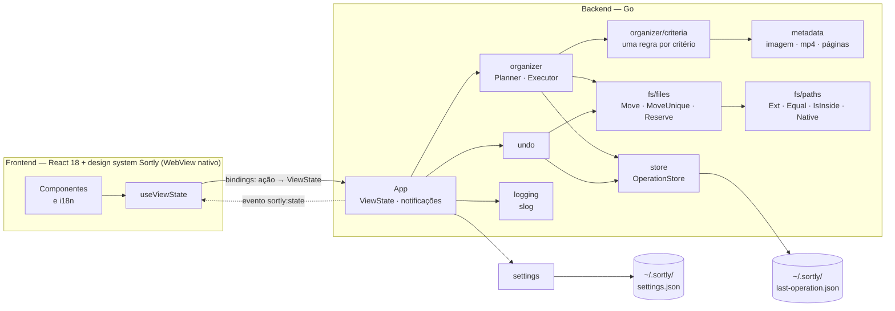

# Arquitetura

> Autores: Caio Reis, Claude

O Sortly usa **Wails v2**: backend em Go e frontend React num WebView nativo. Por que não Electron: [ADR 0001](adr/0001-electron-para-wails.md). As regras de negócio estão em [organization-rules.md](organization-rules.md).

## 1. Visão geral

O Wails usa o WebView nativo do sistema (WebView2 no Windows, WKWebView no macOS, WebKitGTK no Linux), em vez de embutir um Chromium e um Node completos. O backend vira um único binário Go.



## 2. Pacotes Go

| Pacote | Responsabilidade |
|---|---|
| `main` (`main.go`) | Embute `frontend/dist`, monta as dependências e chama `wails.Run`. Fica na raiz porque o `go:embed` não aceita `..` e a CLI do Wails v2 compila o pacote da pasta do `wails.json` |
| `backend/app` | Fachada `App` exposta ao frontend: guarda o estado da tela (`ViewState`, notificações), delega as regras aos serviços e emite `sortly:state`; também as opções da janela (`Options`) e a composição das dependências (`wire.go`) |
| `backend/organizer` | Validação do pedido, `Planner` (calcula o plano, sem efeitos colaterais), `Executor` (aplica os movimentos e mantém o journal), erros com código ([ADR 0004](adr/0004-erros-com-codigo.md)) |
| `backend/organizer/criteria` | Os seis critérios, um por arquivo, atrás da interface `Rule` e do registry `New` ([ADR 0003](adr/0003-strategy-regras.md)); `Options` (com a ordem de exibição `Keys` e o acesso por chave) e `File` |
| `backend/settings` | Preferências (idioma e critérios) em `~/.sortly/settings.json`: lê uma vez, aceita só valores válidos, recusa desligar o último critério e grava com `files.WriteAtomic`; monta a visão para a tela (`View`) |
| `backend/metadata` | Leitura de resolução de imagens, duração de mp4 e contagem de páginas (`PageCounter` por extensão) |
| `backend/undo` | Reverte o journal da última operação e remove as pastas que ficaram vazias |
| `backend/store` | `OperationStore`: lê e grava o registro da última operação de forma atômica, no mesmo formato JSON da versão 1.0 |
| `backend/fs/files` | Operações em disco: `WriteAtomic` (temporário + sync + rename), `Move` (rename com fallback entre volumes), `MoveUnique`/`Reserve` (nome livre com criação exclusiva), `MkdirAll`, `Exists`, `RemoveEmptyDir` |
| `backend/fs/paths` | Caminhos sem tocar no disco: `Ext` (como o `path.extname` do Node), `Equal`/`IsInside` (caixa de cada sistema) e `Native` (prefixo `\\?\` no Windows) |
| `backend/apperr` | Erros com código estável ([ADR 0004](adr/0004-erros-com-codigo.md)) |
| `backend/logging` | Configuração do `log/slog` em arquivo |

Princípios:

- **Injeção de dependências por construtor.** Interfaces pequenas, declaradas no pacote que as consome, permitem usar fakes nos testes.
- **Planejar separado de executar.** O `Planner` não toca no disco, o que o torna fácil de testar e prepara um futuro modo de pré-visualização.
- **`context.Context`** em operações longas, já preparado para cancelamento e progresso.
- **Complexidade ciclomática ≤ 10 por função**, verificada no CI.

## 3. Contrato com o frontend (bindings)

O frontend só renderiza ([ADR 0005](adr/0005-estado-da-tela-no-backend.md)). A fachada `backend/app.App` guarda o estado da tela, e **todo binding devolve o estado completo** (`ViewState`). Os métodos viram funções JavaScript em `frontend/wailsjs/go/app/App.js`, com tipos em `models.ts`.

| Binding | O que faz |
|---|---|
| `GetState()` | Devolve o estado. Na primeira chamada, recupera a última organização desfazível e avisa (`RECOVERED_LAST_ORGANIZATION`) |
| `SelectSource()` / `SelectDestination()` | Abre o seletor de pasta; cancelar não muda nada |
| `DropPaths(paths)` | Define a origem a partir do primeiro item solto (a pasta, ou a pasta do arquivo) |
| `Organize()` | Organiza a origem no destino (vazio = a própria origem) com os critérios salvos. Sem origem: `SOURCE_REQUIRED` |
| `Undo()` | Desfaz a última organização |
| `MarkNotificationsRead()` | Apaga o ponto de não lidas do sino; a lista continua |
| `ClearNotifications()` | Apaga o histórico de notificações |
| `SetLanguage(language)` / `SetCriterion(key, enabled)` | Alteram as preferências (`backend/settings`) |

```
ViewState {
  version: number                            // cresce a cada estado entregue
  sourceFolderPath, destinationFolderPath: string
  hasUndo: bool
  busy: "" | "organize" | "restore"          // ação em andamento
  unread: bool                               // há notificação nova desde a última leitura
  settings: { language, criteria: [{ key, enabled, locked }] }
  notifications: [{ id, kind: "success" | "info" | "error", code, action, path?, organize?, undo?, at }]   // até 80, a mais recente primeiro
}
```

- **Erros não rejeitam a promessa:** viram uma notificação `kind: "error"` com o código (`INVALID_SOURCE`, `NOTHING_TO_UNDO`, `DROPPED_MISSING`, `LAST_CRITERION`, `UNEXPECTED`…) e a ação que falhou. O detalhe vai para o log. O frontend traduz o código, ou usa o texto padrão da ação quando o código não tem tradução própria (ADR 0004).
- **Notificações de sucesso** também são códigos com dados: `ORGANIZE_DONE` (com `organize`: movidos, falhas, ignorados…), `UNDO_DONE` (com `undo`) e `SOURCE_DROPPED` (com `path`).
- **Status (`kind`):** o backend decide se o aviso é sucesso, neutro ou erro. Organizar ou desfazer com algum arquivo que falhou é `error`, e organizar sem nada movido é `info`. A interface usa o `kind` para o ponto do painel e a variante do toast; o toast de erro fica até o usuário fechar.
- **Evento `sortly:state`:** emitido a cada mudança, com o estado inteiro. É por ele que a tela mostra "Organizando…" enquanto a chamada de `Organize` ainda não terminou.
- **Estados fora de ordem:** evento e retorno do binding saem do lock antes de chegar à tela, então duas ações quase simultâneas podem entregá-los fora de ordem. O `useViewState` só troca o estado por um de `version` maior.
- **Organizar e desfazer não rodam juntos:** uma chamada durante a outra devolve o estado sem fazer nada.
- **Listas são sempre arrays** no JSON, nunca `null`.

**Log:** `backend/logging` grava em `sortly.log` na pasta de configuração do usuário (`%AppData%\Sortly\logs` no Windows, `~/Library/Application Support/Sortly/logs` no macOS, `~/.config/Sortly/logs` no Linux). Ao passar de 5 MB, o arquivo vira `sortly.log.1` na próxima abertura. Como o log traz caminhos de arquivos do usuário, no macOS e no Linux a pasta é `0o700` e os arquivos `0o600` (logs de versões anteriores são corrigidos ao abrir); a pasta `~/.sortly` também é criada só para o dono. Se a pasta não puder ser usada, o log vai para o stderr e o app abre normalmente.

## 4. Frontend

A interface segue o design system "Sortly" (sidebar preta, amarelo `#F5E600`, fonte pixel; [ADR 0006](adr/0006-design-system-no-lugar-do-tailwind.md)), e o frontend não tem regra de negócio ([ADR 0005](adr/0005-estado-da-tela-no-backend.md)):

| Módulo | Responsabilidade |
|---|---|
| `hooks/useViewState.js` | Único módulo que importa os bindings e o runtime do Wails. Espelho do `ViewState`: estado inicial, evento `sortly:state`, arquivos soltos (`DropPaths`) e as ações; fora do Wails, fica no estado inicial |
| `i18n/` | Textos PT/EN; `notifications.js` transforma notificações estruturadas em título e texto no idioma atual |
| `views/` | Shell (`OrganizerView`: sidebar, cabeçalho e a página aberta) e as páginas Organizar e Configurações |
| `components/` | Peças do design system: Sidebar, PageHead, Dropzone, PathField, botões, Switch, notificações, toasts e ícones |
| `styles/` | `tokens.css` (temas), `components.css` (classes `st-*` do design system, sem edição) e `app.css` (fonte embutida e ajustes) |

A estrutura de pastas do repositório está em [development.md](development.md#3-estrutura-do-repositório).

## 5. Compatibilidade com a versão 1.0

- Os nomes das pastas criadas são idênticos.
- O formato de `~/.sortly/last-operation.json` é o mesmo, então um desfazer pendente da versão 1.0 funciona na 2.0.
- Os textos em português exibidos ao usuário continuam os mesmos.
- As preferências da 1.0 ficavam no `localStorage` do Electron e **não** são migradas. Na 2.0 elas ficam em `~/.sortly/settings.json`, fora do WebView. O usuário volta aos padrões (português, critério Extensão) uma única vez.
